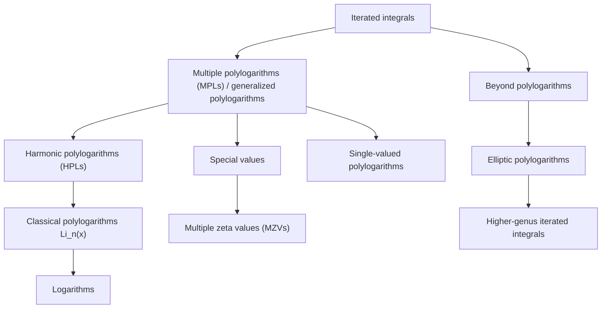
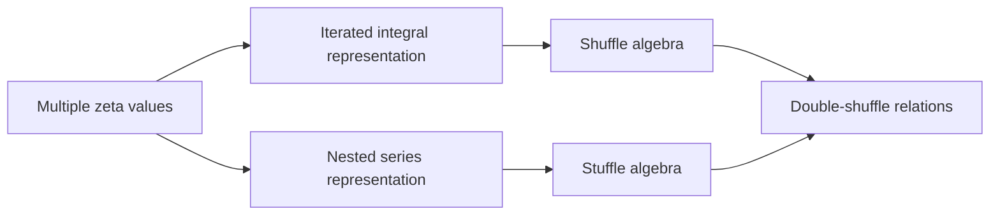

# Polylogarithms, Harmonic Polylogarithms, and Multiple Zeta Values


Exploratory code and notebooks studying the hierarchy of **polylogarithmic special functions** used in

- number theory
- algebraic geometry
- perturbative quantum field theory
- multiloop Feynman integral computations

The project focuses on the relationships between

- logarithms  
- classical polylogarithms Liₙ(x).
- **harmonic polylogarithms (HPLs)**  
- **multiple polylogarithms (MPLs / generalized polylogarithms)**  
- **multiple zeta values (MZVs)**

and the algebraic structures connecting them:

- shuffle algebras  
- stuffle (quasi-shuffle) algebras  
- double-shuffle relations 
- Hopf algebra structures and coproducts

The repository combines **mathematical exposition** in Jupyter notebooks with **Python experimentation**.

---

# Repository structure

```
harmonic-polylog
│
├── pyproject.toml        Project configuration (uv / PEP 621)
├── hpl.py                Experimental HPL utilities
│
├── theory.ipynb          Mathematical theory and derivations
├── exploration.ipynb     Numerical exploration and experiments
│
└── README.md
```

---

# Mathematical hierarchy of functions

These functions arise from the theory of **iterated integrals**.



Interpretation:

- **MPLs** form the central class of polylogarithmic functions.
- **HPLs** are a restricted alphabet widely used in physics.
- **MZVs** arise as special values of MPLs.
- More complicated Feynman integrals require **elliptic polylogarithms**.

---

# Algebraic structures

Multiple zeta values possess two compatible product structures.



Explanation:

- **Shuffle relations** arise from iterated integrals.
- **Stuffle relations** arise from nested sums.
- **Double-shuffle relations** arise from requiring both descriptions to agree.

These relations generate many identities among MZVs.

---

# Notebooks

## `theory.ipynb`

A conceptual overview covering

- iterated integrals
- classical polylogarithms
- harmonic polylogarithms
- multiple polylogarithms
- multiple zeta values
- shuffle and stuffle algebras
- double-shuffle relations
- Hopf algebra structure
- polylogarithms in Feynman integrals

Includes a worked example:
ζ(2) ζ(3) = ζ(2,3) + ζ(3,2) + ζ(5)
expanded using shuffle and stuffle products.

---

## `exploration.ipynb`

Interactive experiments including

- numerical evaluation of polylogarithms
- exploring identities among MZVs
- symbolic checks using ***SymPy***
- plotting special functions

---

# Python module

`hpl.py` contains experimental utilities for working with **harmonic polylogarithms**.

Features include

- recursive HPL definitions
- symbolic manipulation
- numerical evaluation using ***mpmath***

This module is currently intended for **experimentation**, not production use.

---

# Installation

This project uses ***uv*** for Python environment management.

## Install uv

Mac (Homebrew)

```bash
brew install uv
```

or

```bash
pip install uv
```

---

## Create environment

From the repository root:

```bash
uv venv
uv pip install -e .
```

---

## Launch notebooks

```bash
uv run jupyter lab
```

or

```bash
uv run jupyter notebook
```

---

# Example usage

Evaluate a classical polylogarithm:

```python
import mpmath as mp

mp.polylog(2, 0.5)
```

Evaluate a zeta value:

```python
mp.zeta(3)
```

which corresponds to the multiple zeta value `ζ(3)`, known as ***Apéry’s constant***.

---

# Why these functions matter

In modern perturbative quantum field theory, many multiloop integrals evaluate to **generalized polylogarithms**.

Typical workflow:

1. derive differential equations for master integrals  
2. transform them into canonical form  
3. integrate as **iterated integrals**

which naturally yields **multiple polylogarithms**.

More complicated integrals require extensions to

- elliptic polylogarithms
- modular iterated integrals
- higher-genus geometries.

---

# References

Chen (1977) — *Iterated path integrals*. Bulletin AMS  

Remiddi & Vermaseren (2000) — *Harmonic polylogarithms*. Int. J. Mod. Phys. A  

Zagier (1994) — *Values of zeta functions and their applications*.  

Goncharov (2001) — *Multiple polylogarithms and mixed Tate motives*.  

Duhr (2012) — *Hopf algebras, coproducts and generalized polylogarithms*. JHEP  

Brown (2012) — *Mixed Tate motives over ℤ*. Annals of Mathematics.

---

# Future directions

Possible extensions for this project:

- implementing a **generalized polylogarithm evaluator**
- computing higher-depth **MZVs**
- implementing explicit **shuffle and stuffle algebra**
- exploring **symbol calculus**
- experiments with **elliptic polylogarithms**

---

# Contributing

Contributions are welcome. Possible contributions include

- new notebooks exploring identities
- numerical algorithms for MPLs
- symbolic implementations of shuffle/stuffle algebras
- visualization tools for polylogarithmic functions

---

# License

This project is licensed under the **GNU General Public License v3.0 (GPL-3.0)**.

You may redistribute and modify this software under the terms of the GPL v3 as
published by the Free Software Foundation.

See the [LICENSE](LICENSE) file for the full license text.
